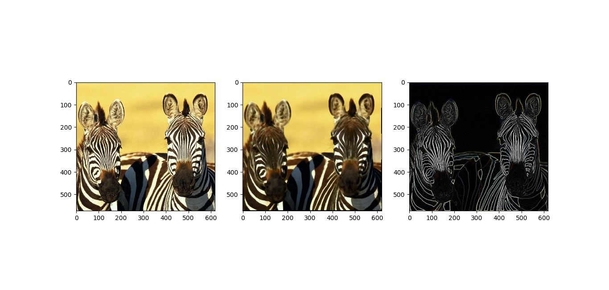

Based on 100+ Times Faster Weighted Median Filter (WMF) by Qi Zhang, Li Xu, and Jiaya Jia.

Implementation in C++, Cython setup. 

This method greatly speeds up WMF by *a lot*, due to a unique combination of raster-line scanning, a data stucture that ensures quick access to occupied elements in sparse vectors, and several other keen observations. But relies on quantization, which given how that's a task onto itself, I didn't want lose focus on the WMF implementation.

I have included an example in Python, that applies WMF to *each* channel, even though it was made with color in mind. 

**TODO:** Rewrite main.py to be an example over a quantized color palette.
